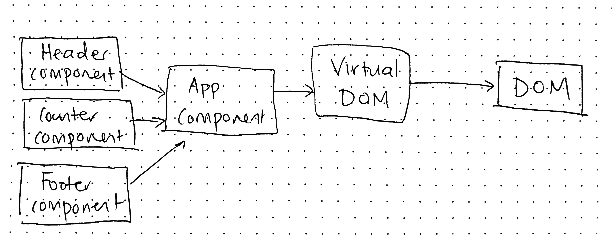

# LAB - 27

## React Testing and Deployment

### Author: Joanna Arroyo

### Links and Resources
* [submission PR](https://github.com/joanna-401-advanced-javascript/lab-27-testing/pull/1)
* [travis](https://travis-ci.com/joanna-401-advanced-javascript/lab-27-testing)
* [Netlify Deployment](https://infallible-ptolemy-59e0dc.netlify.com/)
* [S3 Deployment](https://joanna-lab-27.s3-us-west-2.amazonaws.com/index.html)
* [AWS Amplify Deployment](https://testing.d2ayjwiq1b0idu.amplifyapp.com/)

#### Documentation
* [styleguide](http://localhost:6060/)

### Modules
#### `app.js`
#### `counter.js`
#### `header.js`
#### `footer.js`

##### Exported Values and Methods
###### `counter -> React counter component`
###### `header -> React header component`
###### `footer -> React footer component`
###### `app -> React fragment`

### Setup
#### Running the app
* `npm start`
  
#### Tests
* Unit tests: `npm run test`
* Lint tests: `npm run lint`

#### UML
